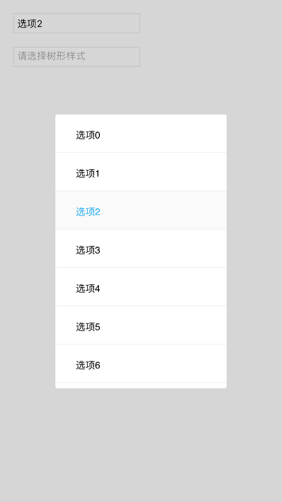
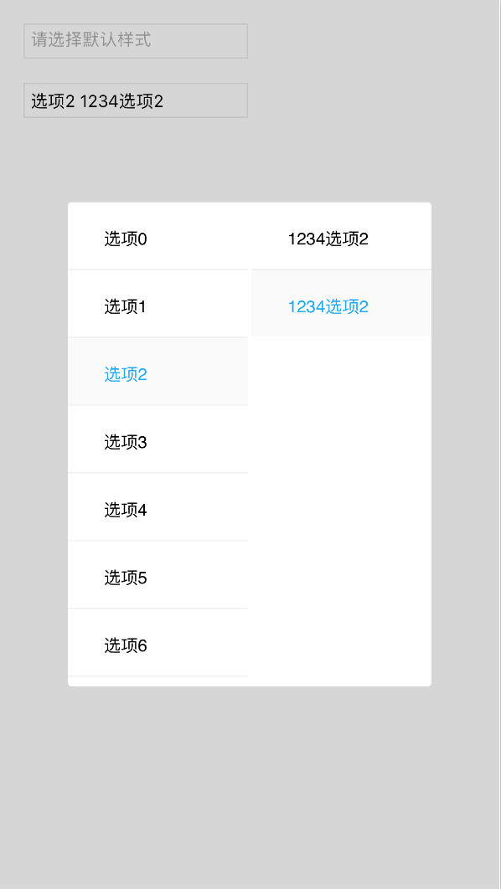

### 移动选项卡—空间文档

#### 简介

一个可以在ios,android ,ipad设备上,代替原生的select控件的控件,有一级选项卡和二级树形选项卡模式

##### 推荐使用环境

移动端设备,pc尚不推荐使用

##### 环境依赖

jsbox.js

##### 默认选项卡



html代码设置

```html
<input placeholder="请选择默认样式" onclick="defaultSelect(this)" readonly="readonly"/>
```

js

```javascript
    /**
     * [data 移动默认选项卡]
     * @type {dom}
     */
    function defaultSelect(input) {
        var data = [];
        for (var i = 0; i < 20; i++) {
            data.push({
                value: "oo" + i, //选项的键值
                text: "选项" + i //选项的提示语
            });
        }
        //input值为点击的input元素,data为传入的渲染的数据源,then其中的回调在,触发值变化的回调
        MobileSelect.tSelect(input, data).then(function(dom) {
            //dom为捕获的元素,是点击的input的指针
            console.log(dom.dataset.val); //该值为选择相应的选项的键值
            console.log(dom.value); //该值为选择相应的选项的显示语
        });
    }
```


##### 树形选项卡



html代码设置

```html
    <input placeholder="请选择树形样式" onclick="treeSelect(this)" readonly="readonly" />
```

js

```javascript
    /**
     * [data 移动二级树形选项卡]
     * @type {dom}
     */
    function treeSelect(input) {
        var data = [];
        for (var i = 0; i < 20; i++) {
            data.push({
                value: "oo" + i, //一级选项的键值
                text: "选项" + i, //一级选项的提示语
                child: [{ //一级选项的二级选项内容
                    value: 123, //含义与一级一样
                    text: 1234 + "选项" + i //含义与一级一样
                }, {
                    value: 13,
                    text: 1234 + "选项" + i
                }]
            });
        }
        //input值为点击的input元素,data为传入的渲染的数据源,then其中的回调在,触发值变化的回调
        MobileSelect.treeSelect(input, data).then(function(dom) {
            //dom为捕获的元素,是点击的input的指针
            console.log(dom.value); //该值为选择相应的选项的显示语
            console.log(dom.dataset.val1 + " " + dom.dataset.val2); //dom.dataset.val1 为一级选项的键值,dom.dataset.val2 为二级选项的键值
        });
    }
```
